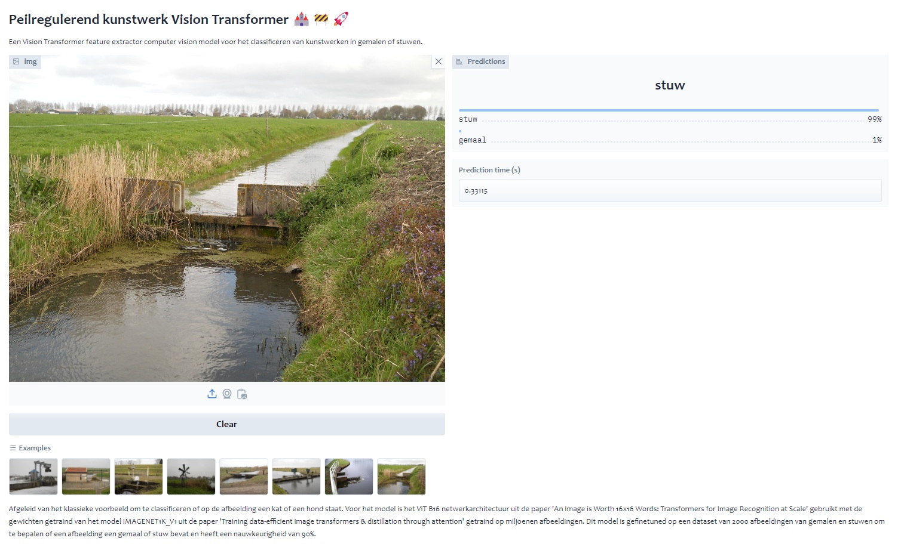

# Kunstwerk ViT

Derived from the classic example of classifying if an image contains a cat or a dog, this model determines whether an image contains a pumping station or a weir with 90% accuracy.



## Table of Contents
- [Introduction](#introduction)
- [Installation](#installation)
- [Usage](#usage)
- [Contributing](#contributing)
- [License](#license)

## Introduction

Derived from the classic example of classifying if an image contains a cat or a dog. The model uses the ViT B16 network architecture from the paper 'An Image is Worth 16x16 Words: Transformers for Image Recognition at Scale' with the weights trained from the IMAGENET1K_V1 model from the paper 'Training data-efficient image transformers & distillation through attention' trained on millions of images. This model was fine-tuned on a dataset of 2000 images of pumping stations and weirs to determine whether an image contains a pumping station or a weir and has an accuracy of 90%.

## Installation

To get started with Kunstwerk ViT, follow these steps:

1. Clone the repository:
    ```bash
    git clone https://github.com/tberends/kunstwerk_vit.git
    ```
2. Navigate to the project directory:
    ```bash
    cd kunstwerk_vit
    ```
3. Install the required dependencies:
    ```bash
    pip install -r requirements.txt
    ```

## Usage

The Gradio app can be started by running ```python app.py```


## Contributing

We welcome contributions to the Kunstwerk ViT project! If you have any ideas, bug reports, or feature requests, please open an issue or submit a pull request.

## License

This project is licensed under the MIT License. See the [LICENSE](LICENSE) file for more details.
